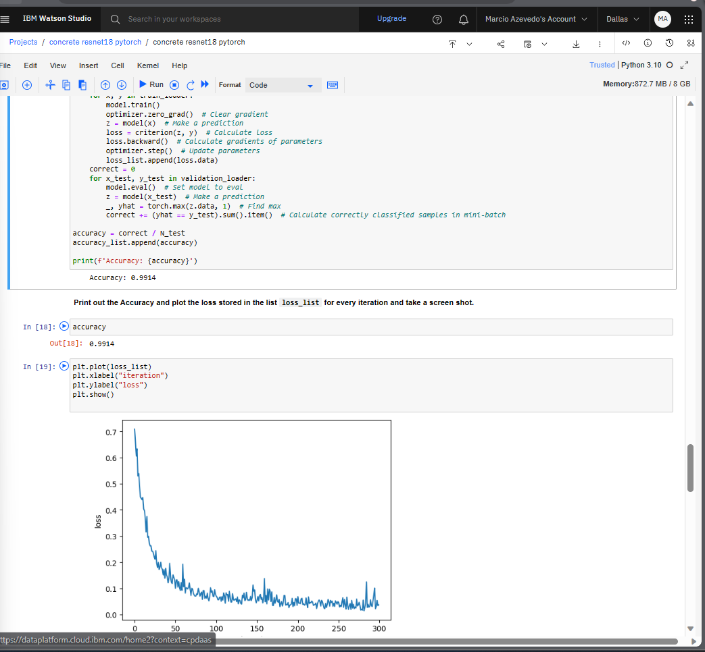

# Concrete Cracks Classifier AI Project

## Overview
This capstone project demonstrates the application of computer vision using deep learning to classify concrete images into cracked and non-cracked categories. Utilizing a dataset of 40,000 images, with an equal split between cracked and non-cracked examples, the model achieved a high accuracy of 0.99 in classifications.

## Technologies
- **Deep Learning Libraries:** Keras, PyTorch
- **Models Used:** ResNet18, ResNet50, VGG16
- **Platform:** AWS SageMaker for MLOps lifecycle
- **Dataset Handling:** Tensors for performance efficiency

## Model Training
The model was trained using the following steps:
1. Dataset conversion to tensors for increased training speed.
2. Implementation of ResNet18, ResNet50, and VGG16 architectures.
3. Deployment of an end-to-end MLOps workflow on AWS SageMaker.

## Results
The final model exhibits robust performance with an accuracy of 0.99. The training process is detailed with loss metrics plotted over iterations to showcase the model's convergence.

## Acknowledgements
The project utilized publicly available data and acknowledged the sources such as Cognitive Class from IBM for providing image data.

## How to Use
Instructions on setting up the environment, running the model, and utilizing the output are detailed within the Jupyter notebook associated with this project.

For a detailed walkthrough of the project, you can view the Jupyter notebook here:

[Concrete ResNet18 PyTorch Notebook](https://github.com/mcante6/concrete_cracks_classifier/blob/main/concrete%20resnet18%20pytorch.ipynb)

The notebook contains the complete code, starting from data preprocessing, model training, to the final evaluation of the classifier. It provides insights into the methodology and the technical approaches used in this project.

*The above image illustrates the loss decline over training iterations, culminating in the final accuracy.*

## Contact
For further information, feel free to contact [Marcio Azevedo](mailto:mar_cio@hotmail.com).

